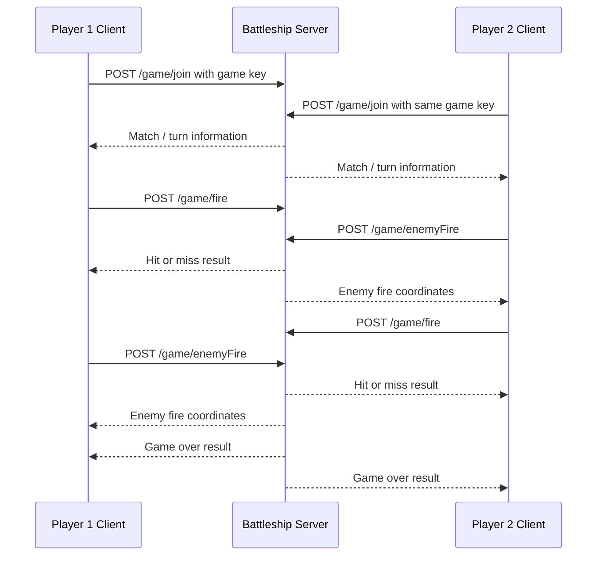
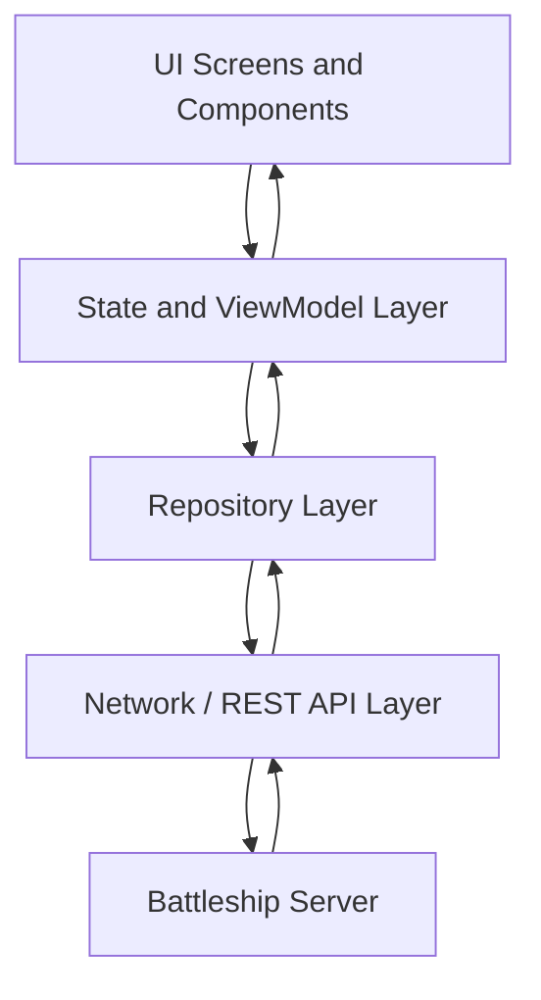

# Fleet Command – Battleship

An online Battleship game developed in **Kotlin** with **Jetpack Compose** for the FHNW *Mobile Applications with Android* course.

The application is designed as an Android client that allows two real players to play a complete Battleship match through the official course server.

---

## Table of contents

* [Project overview](#project-overview)
* [Project member](#project-member)
* [Assignment requirements](#assignment-requirements)
* [Game rules](#game-rules)
* [How to run the project](#how-to-run-the-project)
* [How to play](#how-to-play)
* [Online multiplayer flow](#online-multiplayer-flow)
* [Application features](#application-features)
* [User interface and design](#user-interface-and-design)
* [Project architecture](#project-architecture)
* [Project structure](#project-structure)
* [Network communication](#network-communication)
* [Error handling](#error-handling)
* [Testing](#testing)
* [Technology stack](#technology-stack)
* [Course concepts applied](#course-concepts-applied)
* [Known limitations](#known-limitations)
* [Privacy and data](#privacy-and-data)
* [Submission information](#submission-information)
* [Credits and references](#credits-and-references)
* [AI assistance disclosure](#ai-assistance-disclosure)
* [Final checklist](#final-checklist)

---

## Project overview

**Fleet Command – Battleship** is a mobile Android application that implements the classic Battleship game.

The goal of the project is to create a client application that communicates with the official Battleship server provided for the course. Two players use two separate clients, enter the same game key, place their fleets, and then play against each other until one fleet has been completely destroyed.

The application focuses on three main goals:

* providing a complete **online two-client Battleship experience**;
* applying Android development concepts taught during the course;
* offering a clear, modern, maritime-themed user interface suitable for mobile devices.

The game is not designed as a local computer-opponent game. The intended mode is **online multiplayer through the official course server**.

---

## Project member

| Name        | Role                                                                            | Project type       |
| ----------- | ------------------------------------------------------------------------------- | ------------------ |
| Davide Pham | Android developer, UI designer, network integration, testing, and documentation | Individual project |

The original assignment allows groups of two to three students. This implementation was completed individually, so the full development responsibility belongs to one student.

---

## Assignment requirements

The official assignment requires an Android client for the Battleship game. The client must communicate with the existing server and must be able to play a complete game against another client.

| Requirement                                 | Implementation                                                             | Status                                 |
| ------------------------------------------- | -------------------------------------------------------------------------- | -------------------------------------- |
| Create an Android Battleship application    | Android project developed in Kotlin                                        | **Implemented**                        |
| Use Android Studio Panda                    | Project intended to be opened from the root folder in Android Studio Panda | **Included**                           |
| Play a complete game against another client | Online multiplayer flow through the official server                        | **Requires final device verification** |
| Use the official Battleship server          | Server base URL: `http://brad-home.ch:50003`                               | **Implemented**                        |
| Support the required server endpoints       | `/game/join`, `/game/fire`, `/game/enemyFire`                              | **Implemented**                        |
| Include project documentation               | README file included in the repository                                     | **Included**                           |
| Explain usage and implementation            | Sections for running, playing, architecture, and network flow              | **Included**                           |
| Submit using Git or ZIP                     | Repository or ZIP can contain code and documentation                       | **Included**                           |
| Grant access if GitHub is private           | Instructor access must be configured before submission                     | **To be completed before submission**  |

---

## Game rules

Battleship is played on a **10 × 10 grid**. Each player places a fleet on their own board and attacks coordinates on the opponent’s board.

The server uses numeric coordinates from `0` to `9`, while the user interface displays the board in a more readable format using:

* columns: **A–J**
* rows: **1–10**

Internally, the application converts the visual coordinates into the coordinate system required by the server.

### Fleet configuration

| Ship       | Length |
| ---------- | -----: |
| Carrier    |      5 |
| Battleship |      4 |
| Destroyer  |      3 |
| Submarine  |      3 |
| PatrolBoat |      2 |

### Placement rules

Ships can be placed in two orientations:

* `horizontal`
* `vertical`

A valid placement must satisfy the following conditions:

* the ship must remain inside the 10 × 10 board;
* ships must not overlap;
* every required ship must be placed before joining a match;
* the ship names sent to the server must use the official names exactly.

### Battle rules

During the battle:

1. The active player selects one enemy coordinate.
2. The application sends the shot to the server.
3. The server replies whether the shot was a hit or a miss.
4. The application waits for the opponent’s move.
5. Turns continue until one player’s complete fleet is destroyed.

The winner is the first player to sink the complete enemy fleet.

---

## How to run the project

### Requirements

* Android Studio Panda
* Android emulator or physical Android device
* Internet connection
* Gradle synchronization enabled

### Steps

1. Clone or download the repository.

```bash
git clone <REPOSITORY_URL>
```

2. Open **Android Studio Panda**.

3. Select:

```text
File > Open
```

4. Open the **root project folder**, not only the `app` folder and not only the `src` folder.

5. Wait for Gradle synchronization to finish.

6. Select an Android emulator or a physical Android device.

7. Make sure the device has an active internet connection.

8. Build and run the app.

```text
Run > Run app
```

If the app cannot reach the server, verify that the device or emulator has internet access.

---

## How to play

### Basic user flow

1. Open the application.
2. Start a new online game or join an existing one.
3. Enter a unique player name.
4. Enter or share a game key.
5. Place the fleet on the board.
6. Rotate ships when necessary.
7. Confirm the fleet placement.
8. Connect to the server.
9. Wait for a second client using the same game key.
10. Begin the battle only after the server has matched the two clients.
11. Select an enemy coordinate to fire.
12. Wait for the opponent’s move.
13. Continue until the match ends.

### Important multiplayer rules

Both players must use:

* **different player names**;
* **the same game key**;
* **an active internet connection**.

Example:

| Client   | Player name | Game key    |
| -------- | ----------- | ----------- |
| Client 1 | Davide      | `battle123` |
| Client 2 | Viet        | `battle123` |

The game key connects the two clients to the same match.

---

## Online multiplayer flow

The application must not simulate a computer opponent in normal online mode. All multiplayer actions must come from the server.

Correct online behaviour:

1. The first client sends a join request.
2. The first client waits for an opponent.
3. The second client joins with the same game key.
4. The server associates both clients with the same match.
5. The server determines whose turn it is.
6. The active player fires.
7. The inactive player receives the enemy fire.
8. The clients alternate turns through the server.
9. The server sends the final result when the game is over.



---

## Application features

The application is designed to include the following features:

* online two-player Battleship gameplay;
* game-key based matchmaking;
* player-name input and validation;
* interactive fleet placement;
* horizontal and vertical ship orientation;
* visual board with coordinates;
* distinction between own board and enemy board;
* hit and miss visualization;
* waiting state while the opponent connects or plays;
* victory and defeat screens;
* basic error messages;
* back navigation;
* maritime-themed visual design;
* responsive Jetpack Compose interface.

---

## User interface and design

The interface was designed with a maritime theme inspired by classic naval battle games.

The visual direction includes:

* ocean-inspired colours;
* sky and sea atmosphere;
* battleship and wave elements;
* clear visual hierarchy;
* large mobile-friendly buttons;
* readable text;
* separate screens for menu, connection, fleet setup, battle, waiting, victory, and defeat.

The board is designed to be understandable during gameplay. Coordinates are displayed using letters and numbers so that the user can clearly identify each cell.

Visual feedback is used for:

* selected cells;
* own ships;
* missed shots;
* successful hits;
* sunk ships;
* current turn;
* waiting state;
* final result.

The graphical design is original or based on generated/open-source elements. No proprietary Battleship assets are intentionally copied.

---

## Project architecture

The project follows a layered structure to keep the code understandable and maintainable.



### UI layer

The UI layer contains Jetpack Compose screens and reusable components.

Responsibilities:

* display screens;
* handle user input;
* show buttons, text fields, boards, and status messages;
* display loading, waiting, error, victory, and defeat states.

### State and ViewModel layer

The state layer manages the current state of the application.

Responsibilities:

* store player name and game key;
* store selected language;
* track the current screen;
* manage loading and error states;
* update the UI after network responses;
* coordinate gameplay actions.

### Domain/model layer

The domain layer contains the core data models.

Examples:

* ship;
* cell;
* board;
* player;
* game state;
* shot result;
* enemy fire result.

Responsibilities:

* represent game data;
* validate ship placement;
* convert UI coordinates to server coordinates;
* track hits and misses.

### Repository layer

The repository layer acts as a bridge between the application logic and the network layer.

Responsibilities:

* call the API layer;
* handle successful responses;
* handle server errors;
* provide simple functions to the ViewModel or state layer.

### Network/API layer

The network layer communicates with the official Battleship server.

Responsibilities:

* send HTTP GET and POST requests;
* serialize request data as JSON;
* parse server responses;
* detect error responses;
* support long waiting responses from the server.

### Testing layer

The testing layer can contain unit tests and manual test procedures.

Relevant areas for testing:

* ship placement validation;
* coordinate conversion;
* request body creation;
* server error handling;
* turn logic;
* victory and defeat flow.

---

## Project structure

A possible project structure is shown below.

```text
app/
├── src/main/java/.../
│   ├── MainActivity.kt
│   ├── model/
│   │   ├── Ship.kt
│   │   ├── Cell.kt
│   │   ├── Board.kt
│   │   └── GameState.kt
│   ├── network/
│   │   ├── BattleshipApi.kt
│   │   ├── BattleshipRepository.kt
│   │   └── dto/
│   ├── ui/
│   │   ├── components/
│   │   │   ├── BattleshipBoard.kt
│   │   │   ├── SeaBackground.kt
│   │   │   └── AppButton.kt
│   │   ├── screens/
│   │   │   ├── HomeScreen.kt
│   │   │   ├── JoinGameScreen.kt
│   │   │   ├── ShipPlacementScreen.kt
│   │   │   ├── BattleScreen.kt
│   │   │   ├── SettingsScreen.kt
│   │   │   ├── HowToPlayScreen.kt
│   │   │   └── ResultScreen.kt
│   │   └── theme/
│   │       ├── Color.kt
│   │       ├── Theme.kt
│   │       └── Type.kt
│   └── util/
│       └── CoordinateConverter.kt
├── src/test/
├── src/androidTest/
└── build.gradle.kts
```

### Directory explanation

| Directory          | Purpose                                                 |
| ------------------ | ------------------------------------------------------- |
| `model/`           | Contains game-related data classes and logic models     |
| `network/`         | Contains REST communication and DTO classes             |
| `ui/components/`   | Contains reusable Compose UI elements                   |
| `ui/screens/`      | Contains full application screens                       |
| `ui/theme/`        | Contains colours, typography, and theme configuration   |
| `util/`            | Contains helper functions such as coordinate conversion |
| `src/test/`        | Contains local unit tests                               |
| `src/androidTest/` | Contains Android instrumentation tests if needed        |

---

## Network communication

The application communicates with the official course server:

```text
http://brad-home.ch:50003
```

### Server endpoints

| Endpoint          | HTTP method | Purpose                                                         |
| ----------------- | ----------- | --------------------------------------------------------------- |
| `/ping`           | GET         | Tests server connectivity                                       |
| `/game/join`      | POST        | Creates or joins a match using player name, game key, and fleet |
| `/game/fire`      | POST        | Sends a shot to the opponent’s board                            |
| `/game/enemyFire` | POST        | Waits for and receives the opponent’s shot                      |

### Important network behaviour

The server uses REST-style communication and JSON request/response bodies.

The `/game/enemyFire` request may take a long time to return because it waits for the opponent’s move. This means the app must show a waiting state and must not freeze the user interface.

The application must not enter a fake match when no real opponent exists. If no opponent has connected yet, the app should clearly show a message such as:

```text
Waiting for opponent...
```

Server errors must be handled and displayed to the user.

---

## Error handling

The application should handle the following cases:

| Error case                      | Expected behaviour                            |
| ------------------------------- | --------------------------------------------- |
| Missing player name             | Show a validation message                     |
| Player name too short           | Require at least 3 characters                 |
| Missing game key                | Show a validation message                     |
| Game key too short              | Require at least 3 characters                 |
| Invalid fleet placement         | Prevent joining until placement is valid      |
| Ship outside board              | Show placement error                          |
| Overlapping ships               | Show placement error                          |
| Duplicate shot                  | Prevent or warn the user                      |
| Network unavailable             | Show a network error message                  |
| Server unavailable              | Show server connection error                  |
| Invalid server response         | Show a safe error message instead of crashing |
| Opponent not connected          | Show waiting state                            |
| Match cancelled or unavailable  | Return to connection screen or show error     |
| Back navigation during gameplay | Ask for confirmation when appropriate         |

---

## Testing

Testing is necessary because the project depends on both local game logic and the external server.

### Suggested testing strategy

| Area                  | What should be tested                                       |
| --------------------- | ----------------------------------------------------------- |
| Fleet placement       | Ships stay inside the grid and do not overlap               |
| Coordinate conversion | UI coordinates A–J / 1–10 convert to server coordinates 0–9 |
| Player validation     | Player name and game key meet minimum requirements          |
| Server ping           | The app can reach the server                                |
| Join flow             | Two clients can join the same game key                      |
| Turn flow             | Only the correct player can fire                            |
| Shot result           | Hits and misses are displayed correctly                     |
| Enemy fire            | Enemy shots update the own board                            |
| Game over             | Victory and defeat screens appear correctly                 |
| Error handling        | Server and network errors do not crash the app              |

### Manual two-client test checklist

Use two clients, for example:

* Android Studio emulator + second emulator;
* Android Studio emulator + physical Android device;
* Android Studio emulator + Appetize.io;
* Android app + official JavaFX reference client.

| Step                                      | Expected result                    |
| ----------------------------------------- | ---------------------------------- |
| Start Client 1                            | App opens normally                 |
| Enter player name on Client 1             | Name is accepted                   |
| Enter game key on Client 1                | Game key is accepted               |
| Place fleet on Client 1                   | Fleet placement is valid           |
| Join game on Client 1                     | Client waits for opponent          |
| Start Client 2                            | App opens normally                 |
| Enter a different player name on Client 2 | Name is accepted                   |
| Enter the same game key on Client 2       | Server matches both clients        |
| Place fleet on Client 2                   | Fleet placement is valid           |
| Start battle                              | One player receives the first turn |
| Fire from active client                   | Hit or miss is shown               |
| Wait for enemy fire                       | Opponent receives the move         |
| Continue turns                            | The match progresses correctly     |
| Sink all ships                            | Game over screen appears           |

Final real-device multiplayer verification should be performed before submission if it has not already been completed.

---

## Technology stack

| Concern          | Technology                                     |
| ---------------- | ---------------------------------------------- |
| Platform         | Android                                        |
| Language         | Kotlin                                         |
| UI framework     | Jetpack Compose                                |
| IDE              | Android Studio Panda                           |
| Build system     | Gradle                                         |
| UI structure     | Compose screens and components                 |
| State management | Compose state / ViewModel-style state handling |
| Networking       | HTTP GET/POST requests                         |
| Data format      | JSON                                           |
| Testing          | Manual testing and unit-testable game logic    |
| Version control  | Git and GitHub                                 |

Only technologies actually present in the final implementation should remain in this table before submission.

---

## Course concepts applied

This project applies the main concepts covered in the Android development course.

### Kotlin basics

The application uses Kotlin as the main programming language. Kotlin concepts applied include:

* variables;
* functions;
* conditional logic;
* loops;
* lists;
* arrays or board-like structures;
* data classes;
* nullable values where needed.

### Jetpack Compose

The user interface is built with Jetpack Compose. The project uses Compose ideas such as:

* composable functions;
* `Column`, `Row`, and `Box`;
* `Text`;
* `TextField`;
* `Button`;
* reusable UI components;
* state-based UI updates.

### User interaction

The app uses user input and event handling for:

* entering player name;
* entering game key;
* selecting or placing ships;
* rotating ships;
* selecting board coordinates;
* firing at enemy cells;
* navigating between screens.

### Displaying data

The board, fleet, game status, hits, misses, and turn information are displayed dynamically based on the current game state.

### Images and graphical elements

The project uses a maritime visual style with ocean, ship, and battle-inspired elements. Graphical elements help make the interface more understandable and engaging.

### Canvas or custom drawing

The board can be represented with custom drawing or reusable Compose components. This allows the app to display:

* a 10 × 10 grid;
* coordinate labels;
* ships;
* selected cells;
* hit and miss indicators.

### Themes and appearance

The application applies a consistent visual style through:

* ocean-inspired colours;
* readable typography;
* consistent buttons;
* clear spacing;
* modern mobile layout.

### Network communication

The project applies HTTP communication concepts through:

* GET request for server ping;
* POST requests for game actions;
* JSON data transfer;
* server response handling;
* long waiting requests for opponent turns.

### State management

The app updates the UI according to the current state:

* home;
* joining;
* waiting;
* placing ships;
* battle;
* victory;
* defeat;
* error.

### Asynchronous operations

Network requests must be performed without blocking the UI. Waiting for an opponent or enemy move should show a clear loading state instead of freezing the application.

---

## Known limitations

The project depends on the external course server. If the server is unavailable, the online game cannot be played.

Known limitations include:

* an active internet connection is required;
* the server may wait for the opponent’s move, causing long response times;
* final verification with two real devices or two independent clients should be completed before submission;
* the app should not be considered fully verified until a complete two-client match has been tested;
* online mode must not be replaced by a local computer opponent.

---

## Privacy and data

The application uses a player name and game key to communicate with the Battleship server.

The app does not require:

* email address;
* password;
* account registration;
* login system;
* payment data.

The project should not claim encryption or permanent data storage unless this is explicitly implemented and verified.

---

## Credits and references

This project was developed for the FHNW *Mobile Applications with Android* course.

References:

* FHNW Mobile Applications with Android course material
* Official Battleship project assignment
* Official course server: `http://brad-home.ch:50003`
* JavaFX reference client: `https://brad-home.ch/battleship.html`
* Android documentation
* Jetpack Compose documentation
* Kotlin documentation

All visual assets should be original, generated, open-source, or correctly attributed.

---

## AI assistance disclosure

AI tools may have been used to support code review, debugging, interface refinement, testing ideas, and documentation improvement.

The student remains responsible for understanding, validating, testing, and submitting the final project.

---

## Conclusion

**Fleet Command – Battleship** demonstrates the development of a complete Android client for an online Battleship game. The project combines Kotlin programming, Jetpack Compose user interfaces, mobile interaction design, game-state management, and REST-based network communication.

The main academic objective is to build a functional and understandable Android application that follows the course concepts while supporting a real two-client online Battleship experience through the official server.
